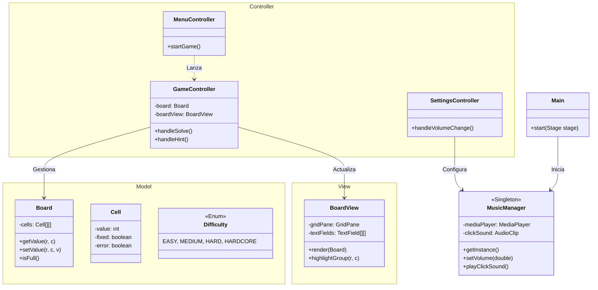
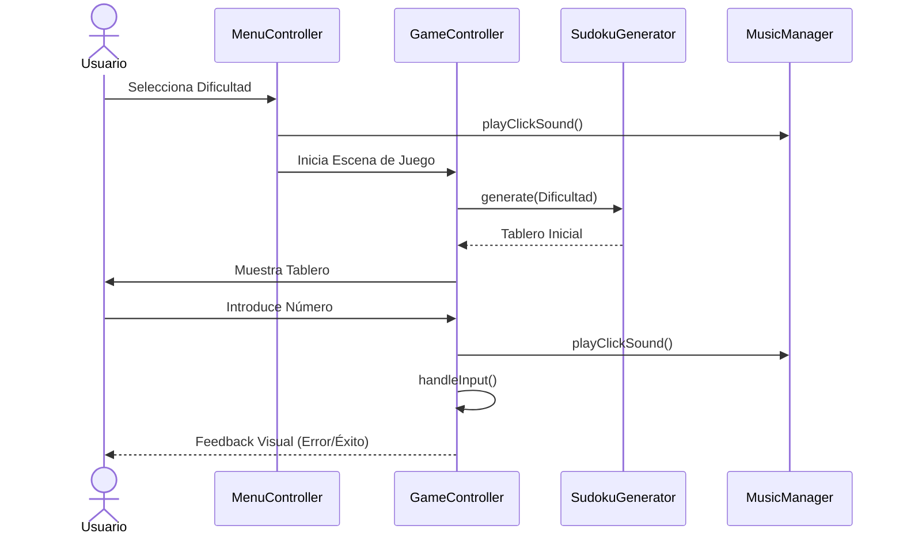
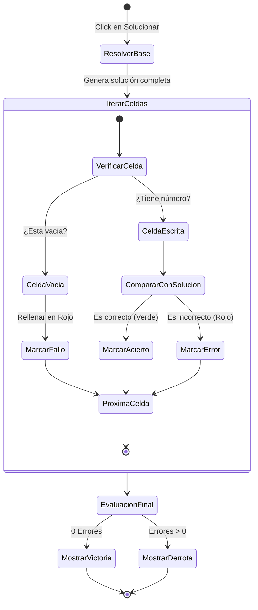

# Arquitectura de Diseño — SUDOKU

El proyecto sigue una arquitectura **MVC (Modelo-Vista-Controlador)** desacoplada, utilizando servicios especializados para la lógica compleja.

## Diagrama de Clases

## Patrones de Diseño Aplicados

1.  **Singleton**: `MusicManager` asegura que la música no se reinicie al cambiar de escena.
2.  **MVC**: Separación estricta entre `Board` (Lógica), `BoardView` (Interfaz) y `GameController` (Orquestación).
3.  **Strategy**: El sistema de generación utiliza diferentes densidades de celdas según el nivel de `Difficulty`.

---

## Diagrama de Secuencia: Flujo de Juego

Este diagrama muestra la interacción desde que el usuario selecciona una dificultad hasta que interactúa con el tablero.

## Diagrama de Actividad: Lógica de Resolución (Solve)

Describe el comportamiento del sistema cuando el usuario pulsa el botón "SOLUCIONAR".

