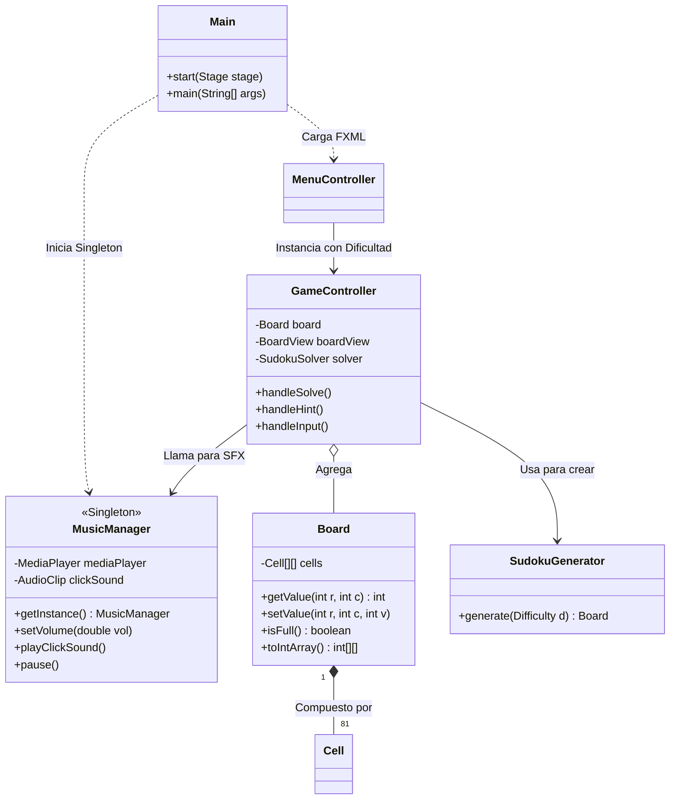
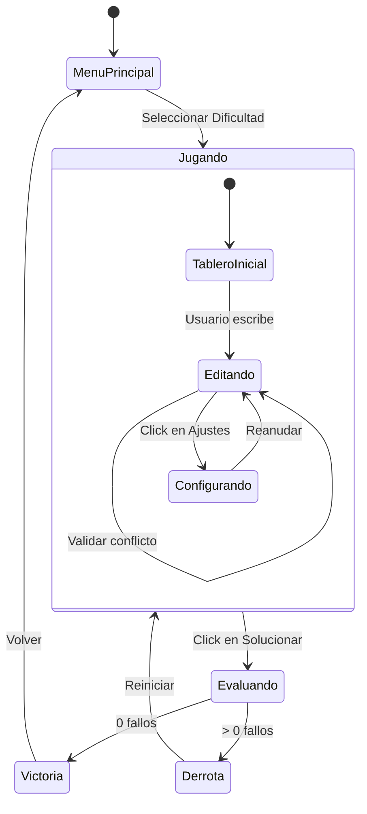
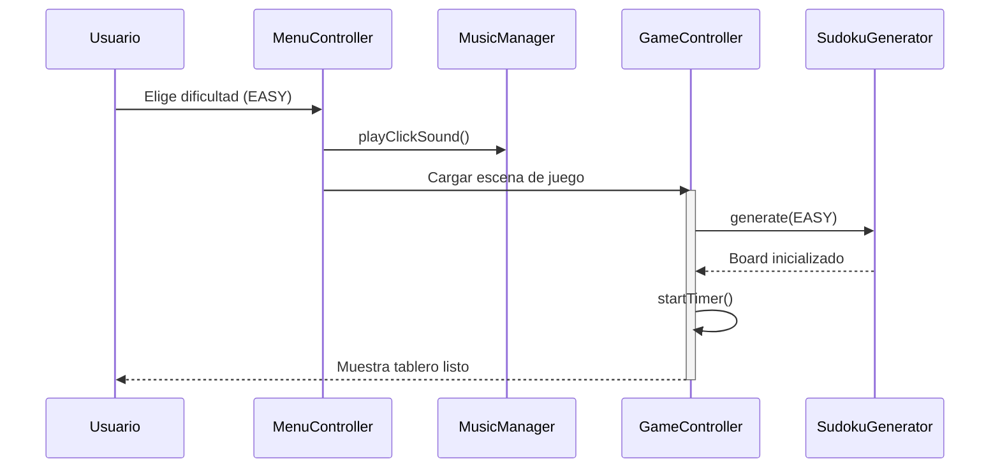
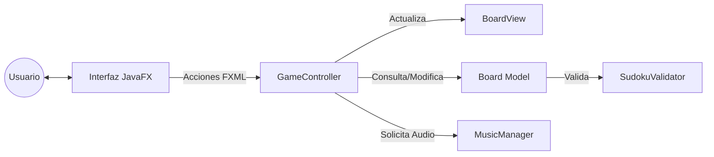
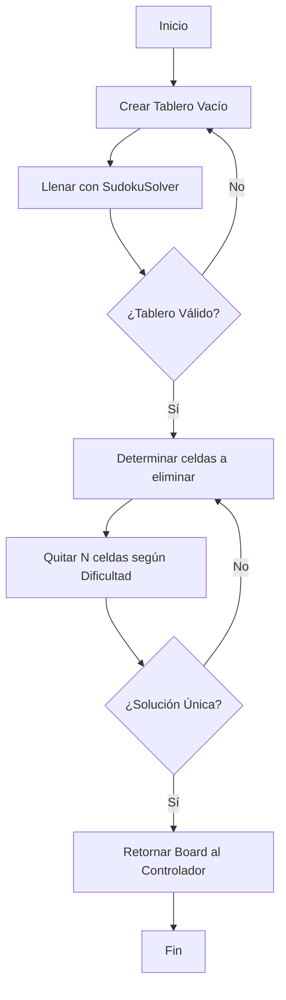
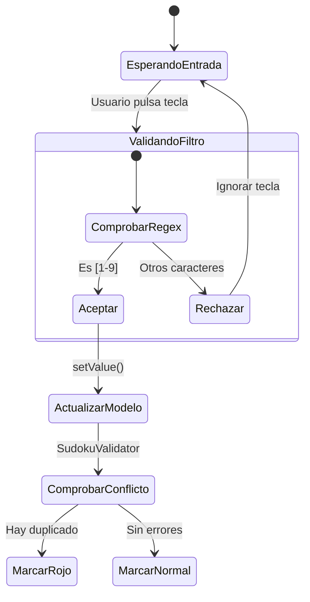

# Arquitectura y Diseño Técnico — SUDOKU

Este documento detalla la estructura, comportamiento e interacciones del sistema mediante diversos diagramas técnicos que ilustran la robustez de la arquitectura **MVC**.

---

## 1. Diagrama de Clases (Estructura Estática)
**Objetivo:** Mostrar la jerarquía de clases, sus métodos principales y cómo se relacionan entre sí.

---

## 2. Diagrama de Estados (Ciclo de Vida del Juego)
**Objetivo:** Definir las fases por las que pasa la aplicación y qué eventos disparan las transiciones.

---

## 3. Diagrama de Secuencia (Inicialización de Partida)
**Objetivo:** Detallar el orden cronológico de los mensajes entre objetos durante el arranque.

---

## 4. Diagrama de Comunicación (Interacción de Componentes)
**Objetivo:** Visualizar cómo fluye la información y los comandos entre las piezas clave del sistema.

---

## 5. Diagrama de Actividad (Generación de Tablero)
**Objetivo:** Explicar el proceso lógico interno del `SudokuGenerator` para crear un reto válido.

---

## 6. Diagrama de Comportamiento (Entrada de Usuario)
**Objetivo:** Describir la respuesta del sistema ante la entrada de datos en una celda.

