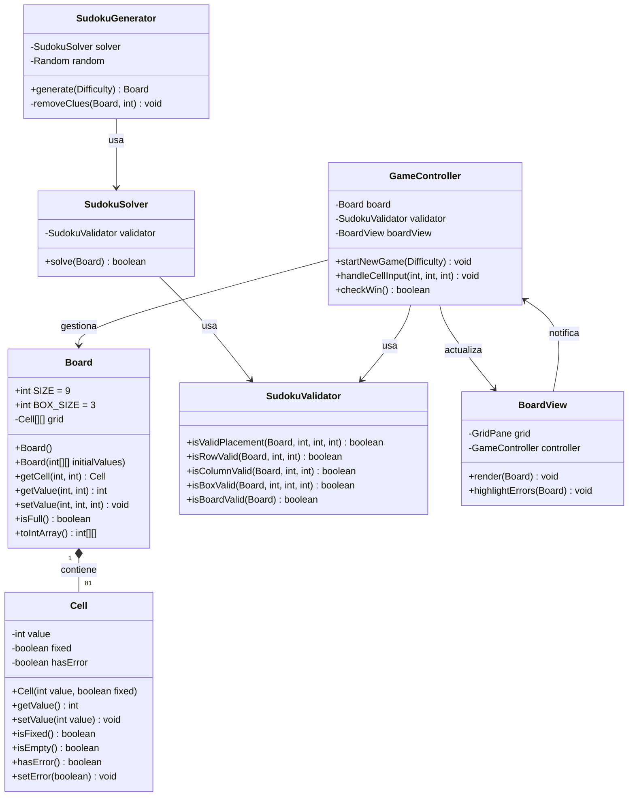
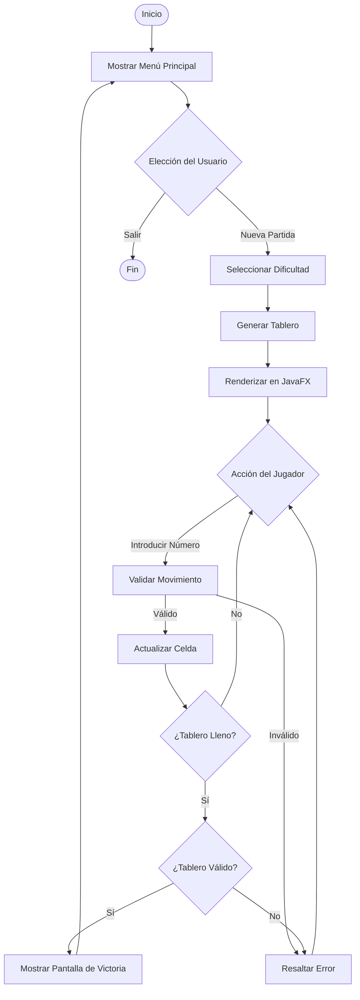
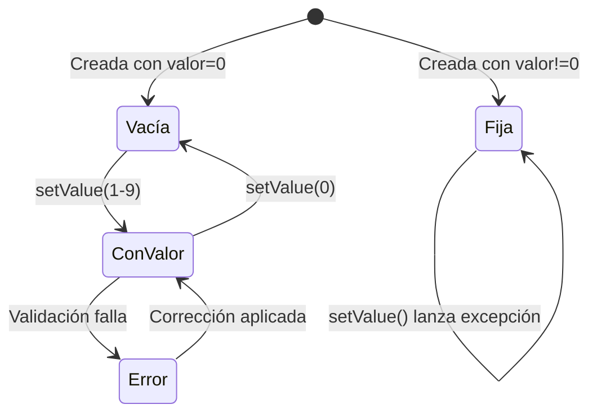

# Diagramas UML

En esta página se detallan los diagramas de arquitectura y flujo del proyecto, generados mediante **Mermaid**.

## Diagrama de Clases

El proyecto sigue una arquitectura **MVC** estricta.

## Diagrama de Actividad — Flujo del Juego

## Diagrama de Estados — Celda

